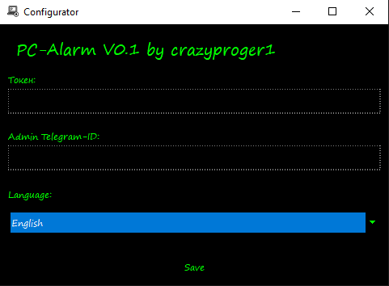
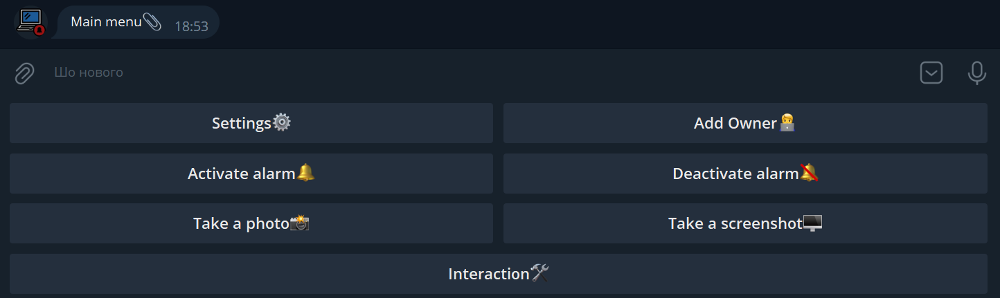
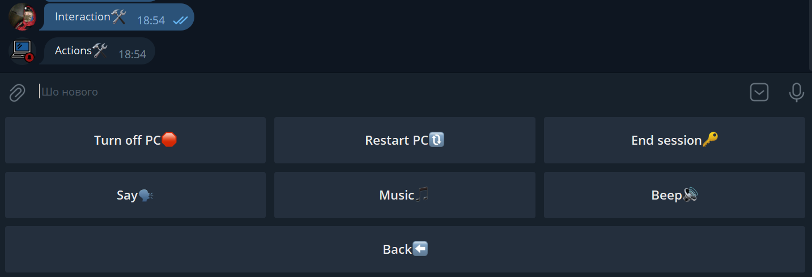
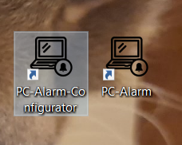

<p align="center">
  
</p>

# PC-Alarm

<a href="https://github.com/CrazyProger1/PC-Alarm/releases/download/V0.1/PC-Alarm-buildV0.1.exe"></a>
<a href="https://github.com/CrazyProger1/PC-Alarm/blob/master/LICENSE"></a>
<a href="https://github.com/CrazyProger1/PC-Alarm/releases/latest"></a>

Introducing PC-Alarm, the ultimate application that ensures your computer is safe and secure even when you're not
around! With PC-Alarm, you can detect if someone else is using your computer while you're away, giving you peace of mind
and added security for your valuable data and privacy.

PC-Alarm is built on Telegram API, providing you with a reliable and secure platform to monitor and control your
computer remotely. The alarm function of PC-Alarm sends you instant notifications on your smartphone or other devices if
someone starts using your computer. You'll be alerted in real-time, allowing you to take immediate action to protect
your data and privacy.

But that's not all! PC-Alarm offers a wide range of additional features that allow you to control your computer from a
distance. With PC-Alarm, you can remotely lock or unlock your computer, shut it down, restart it, or put it to sleep.

PC-Alarm is incredibly user-friendly and easy to set up. It runs seamlessly in the background, constantly monitoring
your computer for mouse use.

Whether you're at work, traveling, or simply away from your computer, PC-Alarm has got you covered. It's the perfect
solution for safeguarding your computer and maintaining control even when you're not physically present.

Don't leave your computer's security to chance. Get PC-Alarm today and gain peace of mind knowing that your computer is
protected 24/7. Download PC-Alarm now and take control of your computer's security like never before!

**Note:** _Description created by ChatGPT._ 😂

## Overview



_Configurator window._



_Main bot menu._



_Some additional useful actions menu._

## Installation

The last version you can
download [here](https://github.com/CrazyProger1/PC-Alarm/releases/download/V0.1/PC-Alarm-buildV0.1.exe).

To install the program, run the downloaded installer and follow the instructions.

After installation, you will see 2 shortcuts on your desktop:



The first one (_PC-Alarm-Configurator.exe_) launches the configurator, the second - the whole program.

**Note:** _The program is automatically added to startup._

## Configuration

#**In development**

## Development

**Note:** _Before starting, make sure you have installed [Python 3.11](https://www.python.org/downloads/)._

Firstly, you need to clone this GIT repository:

```shell
git clone https://github.com/CrazyProger1/PC-Alarm
```

Then, install the requirements:

```shell
pip install -r requirements.txt
```

That's all, now you can start bot with the command:

```shell
python main.py
```

To start the configurator use the following command:

```shell
python main.py --configurator
```

## Building

**Note:** _Make sure you have installed [PyInstaller](https://pypi.org/project/pyinstaller/)._

To build, execute the following command from base folder:

```commandline
"scripts/build.bat"
```

On Windows.

```bash
sh ./scripts/build.sh
```

On Linux.

Now, you can find an executable file at [dist/main](dist/main).

## L18N

**Available languages:**

- [x] Ukrainian
- [x] English

### Translation-Guide

Firstly, you need to go to folder: [resources/languages/pot](resources/languages/pot). There you will
find [.pot](https://en.wikipedia.org/wiki/Gettext) files.

Each part of the application has its own [.pot](https://en.wikipedia.org/wiki/Gettext) template:

- Configurator - [configurator.pot](resources/languages/pot/configurator.pot)
- Bot - [bot.pot](resources/languages/pot/bot.pot)

[.pot](https://en.wikipedia.org/wiki/Gettext) template files can be open with applications such as
[Poedit](https://poedit.net/), [Localizely](https://localizely.com/), [Transifex](https://www.transifex.com/) and many
others.

Tutorials:

- [Poedit](resources/docs/POEDIT.MD)

## Functionality

- [x] Alarm (Main Goal)
- [x] L18N
    - [x] English
    - [x] Ukrainian

- [x] Interactive Actions / Commands
    - [x] Shutdown PC
    - [x] Restart PC
    - [x] End Session
    - [x] Say
    - [x] Music
    - [x] Beep
    - [x] Photo
    - [x] Screenshot

- [x] Configurator
    - [x] Changing Bot Token
    - [x] Admin Telegram-ID
    - [x] UI L18N

## License

PC-Alarm is released under the MIT License. See the bundled [LICENSE](LICENSE) file for details.
