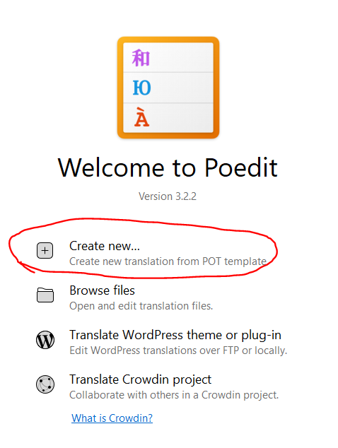
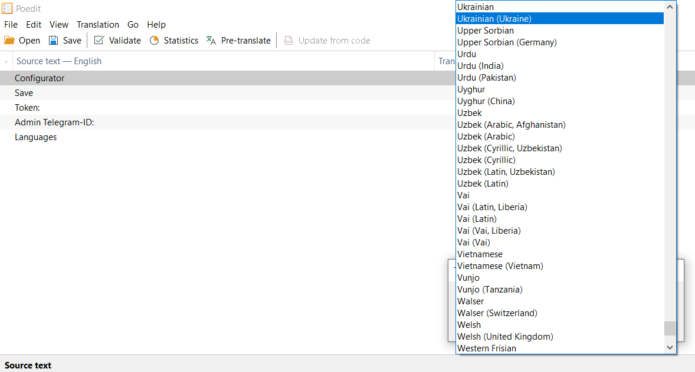
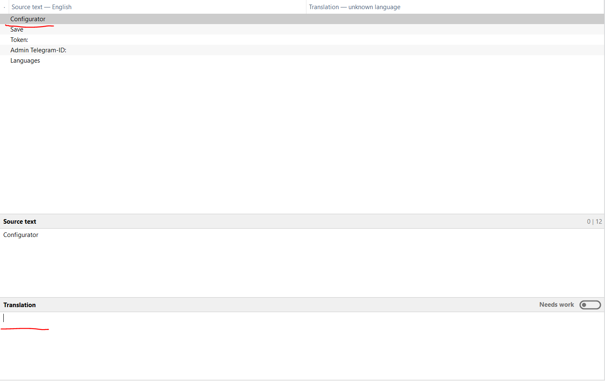
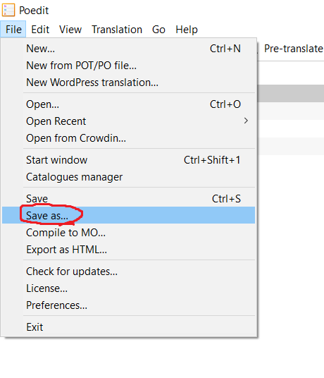

# Poedit Tutorial

> Create new translation from POT template.


> Select translation language.


> Select a string and write a translation for it.


> Save .po file to [resources/languages/](../languages){**folder**}/LC_MESSAGES/. Where **folder** - directory named
> with the
> first two
> letters of the language name (English - en, Ukrainian - uk)


> Create file named **.lang** in [resources/languages](../languages){folder}/. It should contain the following content:

```json
{
  "short_name": "First two small letters of language name",
  "full_name": "The full name of the language written in it"
}
```

**Examples:**

```json
{
  "short_name": "en",
  "full_name": "English"
}
```

```json
{
  "short_name": "uk",
  "full_name": "Українська"
}
```

After completing all the steps - you should get the following file tree:

```
languages
    |
    + {folder named like (uk, en, pl)}
         |
         + .lang
         + LC_MESSAGES
                |
                + bot.po
                + configurator.po
                + bot.mo
                + configurator.mo
```
